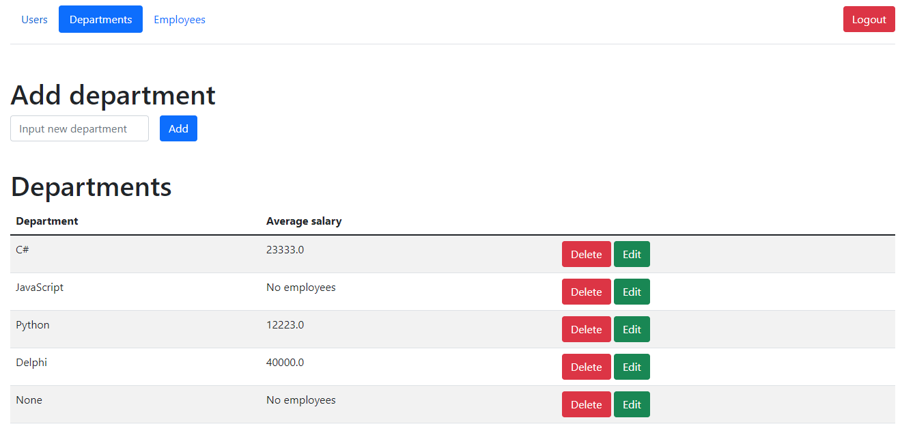
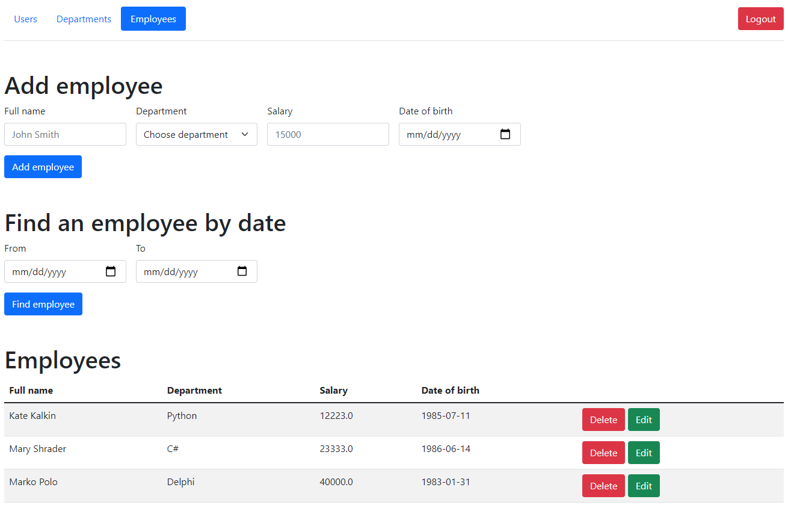
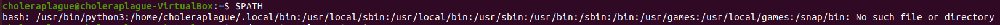
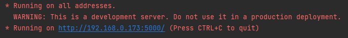

# Flask app

---

### Table of Contents

- [Description](#description)
- [How To Use](#how-to-use)
- [References](#references)
- [License](#license)
- [Author Info](#author-info)

---

## Description

Project represents web application with authentication and
managing database of its users, departments and employees.


### Structure
1) migrations - manages database schema changes
2) models - DB models
3) service - modules with functions to work with DB (CRUD operations)
4) sql - *.sql files to work with DB
5) rest - modules with RESTful service implementation
6) templates - html templates
7) static - *.js files
8) tests - modules with unit tests
9) modules with Web controllers
---
### Authentication
Before getting access to contents of database a user must log in(default login: admin password: qwerty)
. Besides, the user can log out provided that the user entered correct credentials.


### Web app tabs

#### Users tab
Here a common user can see its login and
password. Admin can add, delete users and edit their information.


#### Departments tab
Here a common user can see what departments 
exist and average salary among them. Admin can add, delete departments
and edit information about them.


#### Employees tab
Here a common user can see information about
employees and find them by birthdate. Admin can add, delete employees
and edit information about them.


---

### Technologies

- Python
- JavaScript
- Flask
- Gunicorn
- Nginx
- Bootstrap

[Back To The Top](#table-of-contents)

---

## How To Use

### Installation
1) To begin with you need to install python. Here url is how to it:
```html
    https://www.youtube.com/watch?v=bXWlyOMYpRE
```
After installing python go to the next step.
2) Having downloaded the project, run command line in project
folder as ADMIN and enter the next command to install crucial
packages so that the web app will work correctly. 
```html
    python setup.py install
```
3) You may want to run the web application with gunicorn and nginx. Therefore,
here the video is on how to install them:
```html
    https://www.youtube.com/watch?v=BpcK5jON6Cg&t=796s
```
Providing that you installed both, enter next commands. 
```html
    sudo systemctl start nginx
```
Check if nginx works correctly:
```html
    sudo systemctl status nginx
```

```html
    gunicorn --workers=3 wsgi:app --daemon
```

--workers=3 stands for working with multiple users and --daemon is used
to maintain the web app 24/7.

!!!NOTE: check if path of python in the $PATH is the first, so that
python scripts will work correctly:


4) If you do not use gunicorn and nginx, enter next command:
```html
    python wsgi.py
```

5) If you installed everything correctly, the web app can be accessed via your
IP( gunicorn and nginx): 

Or if you run from wsgi.py via IP and Port:




[Back To The Top](#table-of-contents)

---

## References
#### Install Python
```html
    https://www.youtube.com/watch?v=bXWlyOMYpRE
```
#### Install Gunicorn and Nginx
```html
    https://www.youtube.com/watch?v=BpcK5jON6Cg&t=796s
```
[Back To The Top](#table-of-contents)

---

## License

MIT License

Copyright (c) [2021] [Serhii Panchenko]

Permission is hereby granted, free of charge, to any person obtaining a copy
of this software and associated documentation files (the "Software"), to deal
in the Software without restriction, including without limitation the rights
to use, copy, modify, merge, publish, distribute, sublicense, and/or sell
copies of the Software, and to permit persons to whom the Software is
furnished to do so, subject to the following conditions:

The above copyright notice and this permission notice shall be included in all
copies or substantial portions of the Software.

THE SOFTWARE IS PROVIDED "AS IS", WITHOUT WARRANTY OF ANY KIND, EXPRESS OR
IMPLIED, INCLUDING BUT NOT LIMITED TO THE WARRANTIES OF MERCHANTABILITY,
FITNESS FOR A PARTICULAR PURPOSE AND NONINFRINGEMENT. IN NO EVENT SHALL THE
AUTHORS OR COPYRIGHT HOLDERS BE LIABLE FOR ANY CLAIM, DAMAGES OR OTHER
LIABILITY, WHETHER IN AN ACTION OF CONTRACT, TORT OR OTHERWISE, ARISING FROM,
OUT OF OR IN CONNECTION WITH THE SOFTWARE OR THE USE OR OTHER DEALINGS IN THE
SOFTWARE.

[Back To The Top](#table-of-contents)

---

## Author Info

- Telegram - @sideshowbobgot
- Email - sideshowbobgot@gmail.com

[Back To The Top](#table-of-contents)
