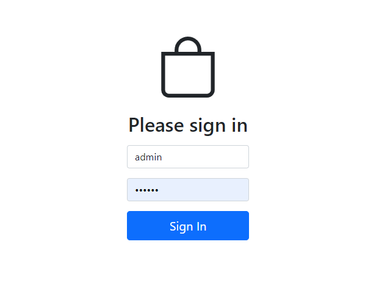
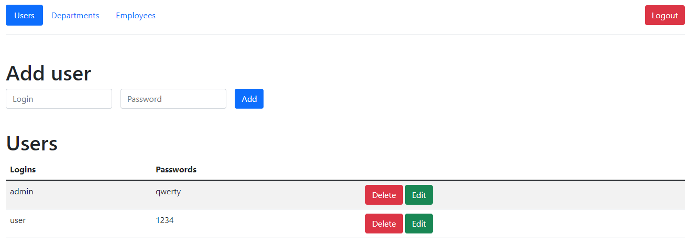
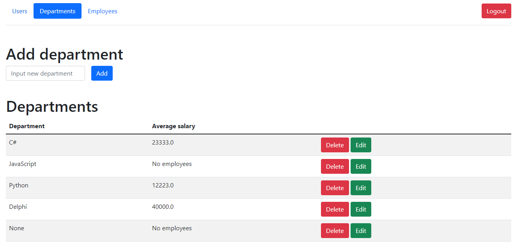
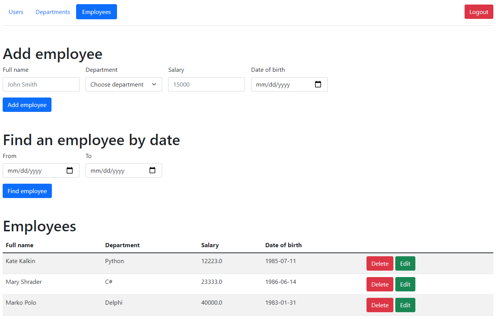
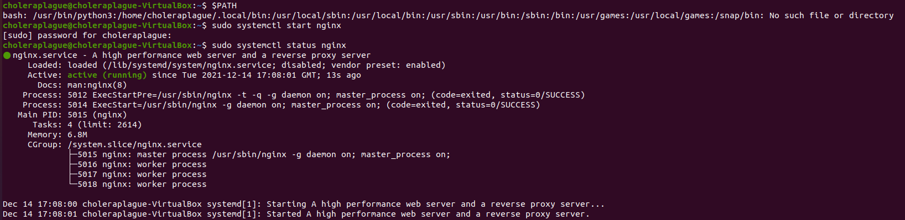
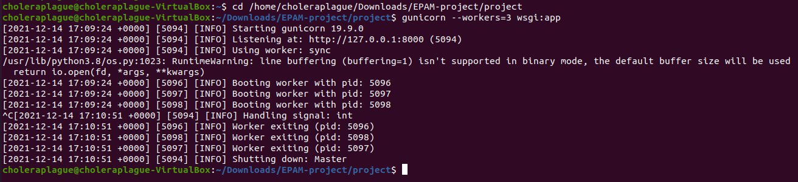
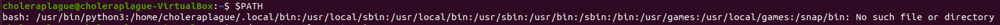
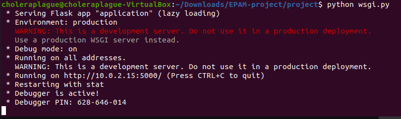
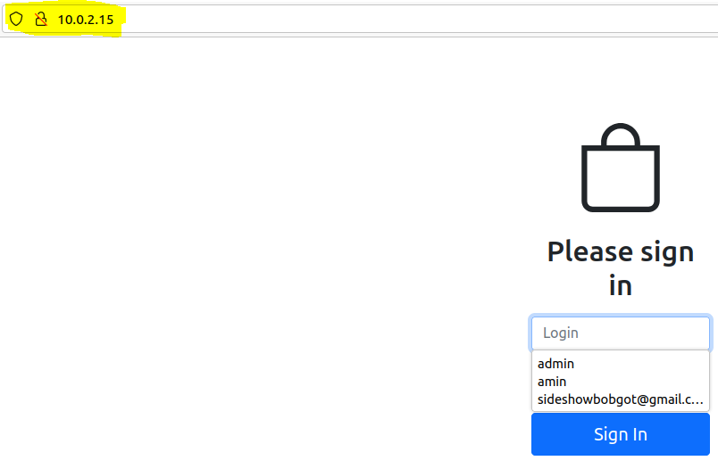
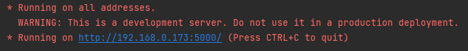

# Flask додаток

---

### Зміст

- [Опис](#description)
- [Як використовувати](#how-to-use)
- [Список посилань](#references)
- [Ліцензія](#license)
- [Інформація про автора](#author-info)

---

## Опис

Проект являє собою веб-додаток з аутентифікацією та
управління базою даних своїх користувачів, відділів і співробітників.


### Структура
1) migrations - керує змінами схеми бази даних
2) models - БД моделі
3) service - модулі з функціями для роботи з БД (CRUD операції)
4) sql - *.sql файли для роботи з БД
5) rest - модулі з реалізацією сервісу RESTful
6) templates - html шаблони
7) static - *.js файли
8) tests - модулі з unit-тестами
9) модулі з веб-контролерами
---
### Аутентифікація
Перш ніж отримати доступ до вмісту бази даних, користувач повинен авторизуватися (логін за замовчуванням: password адміністратора: qwerty)
. Крім того, користувач може ввійти за умови, що він ввів правильні облікові дані.



### Вкладки веб-додатків

#### Вкладка користувачів
Тут звичайний користувач може побачити свій логін і
пароль. Адміністратор може додавати, видаляти користувачів і редагувати їхню інформацію.



#### Вкладка відділів
Тут звичайний користувач може побачити, які відділи
серед них є і середня зарплата. Адміністратор може додавати, видаляти відділи
та редагувати інформацію про них.


#### Вкладка співробітників
Тут звичайний користувач може побачити інформацію про
співробітників і знайти їх за датою народження. Адміністратор може додавати, видаляти співробітників
та редагувати інформацію про них.


---

### Технології

- Python
- JavaScript
- Flask
- Gunicorn
- Nginx
- Bootstrap

[Назад до початку](#table-of-contents)

---

## Як використовувати

### Встановлення
1) Для початку вам потрібно встановити python. Ось URL-адреса, як це зробити:
```html
    https://www.youtube.com/watch?v=bXWlyOMYpRE
```
Після встановлення python перейдіть до наступного кроку.
2) Завантаживши проект, запустіть командний рядок у папці проекту як ADMIN і введіть наступну команду для встановлення вирішального
пакети, щоб веб-програма працювала правильно.
```html
    python setup.py install
```
3) Ви можете запустити веб-програму за допомогою gunicorn і nginx. тому
ось відео про те, як їх встановити:
```html
    https://www.youtube.com/watch?v=BpcK5jON6Cg&t=796s
```
Якщо ви встановили обидва, введіть наступні команди.
```html
    sudo systemctl start nginx
```
Перевірте, чи правильно працює nginx:
```html
    sudo systemctl status nginx
```

```html
    gunicorn --workers=3 wsgi:app --daemon
```

--workers=3 означає роботу з кількома користувачами та використовується --daemon, щоб
підтримувати веб-програму 24/7.

!!!ПРИМІТКА: перевірте, чи шлях python у $PATH є першим, щоб
скрипти python працюватимуть правильно:


4) Якщо ви не використовуєте gunicorn і nginx, введіть наступну команду:
```html
    python wsgi.py
```

5) Якщо ви все встановили правильно, до веб-програми можна отримати доступ через ваш
IP (gunicorn і nginx):

Або якщо ви запускаєте з wsgi.py через IP та порт:




[Назад до початку](#table-of-contents)

---

## Список посилань
#### Встановити Python
```html
    https://www.youtube.com/watch?v=bXWlyOMYpRE
```
#### Встановіть Gunicorn і Nginx
```html
    https://www.youtube.com/watch?v=BpcK5jON6Cg&t=796s
```
[Назад до початку](#table-of-contents)

---

## Ліцензія

MIT Ліцензія

Copyright (c) [2021] [Сергій Панченко]

Цим надається безкоштовний дозвіл будь-якій особі, яка отримує копію
цього програмного забезпечення та відповідних файлів документації («Програмне забезпечення»)
у Програмному забезпеченні без обмежень, включаючи без обмежень права
використовувати, копіювати, змінювати, об’єднувати, публікувати, поширювати, субліцензувати та/або продавати
копії Програмного забезпечення та дозволити особам, яким це Програмне забезпечення
наділений для цього за умови дотримання наступних умов:

Наведене вище повідомлення про авторські права та це повідомлення про дозвіл мають бути включені до всіх
копії або значні частини Програмного забезпечення.

ПРОГРАМНЕ ЗАБЕЗПЕЧЕННЯ НАДАЄТЬСЯ «ЯК Є», БЕЗ БУДЬ-ЯКИХ ГАРАНТІЙ, ЯВНИХ АБО
МАЄТЬСЯ НА УМОВІ, ВКЛЮЧАЮЧИ, АРЕМЕ НЕ ОБМЕЖУЮЧИСЯ ГАРАНТІЯМИ КОМЕРЦІЙНОЇ ЦІННОСТІ,
ПРИДАТНІСТЬ ДЛЯ КОНКРЕТНОЇ МЕТИ ТА ВІДСУМНІСТЬ ПРАВ. У ЖОДНОМУ РАЗІ
АВТОРИ АБО ВЛАСНИКІ АВТОРСЬКИХ ПРАВ НЕСУТЬ ВІДПОВІДАЛЬНІСТЬ ЗА БУДЬ-ЯКІ ПРЕТЕНЗІЇ, ЗБИТКИ АБО ІНШІ
ВІДПОВІДАЛЬНІСТЬ ЗА ДОГОВОРОМ, ДЕЛІКТОМ ЧИ ІНШИМ ЧИМО, ЩО ВИНАХОДИТЬ,
ПОЗА ПРОГРАМНИМ ЗАБЕЗПЕЧЕННЯМ АБО У ЗВ’ЯЗКУ З НИМИ АБО ВИКОРИСТАННЯМ АБО ІНШИМИ ОПЕРАЦІЯМИ В
ПРОГРАМНЕ ЗАБЕЗПЕЧЕННЯ.

[Назад до початку](#table-of-contents)

---

## Інформація про автора

- Telegram - @sideshowbobgot
- Email - sideshowbobgot@gmail.com

[Назад до початку](#table-of-contents)
